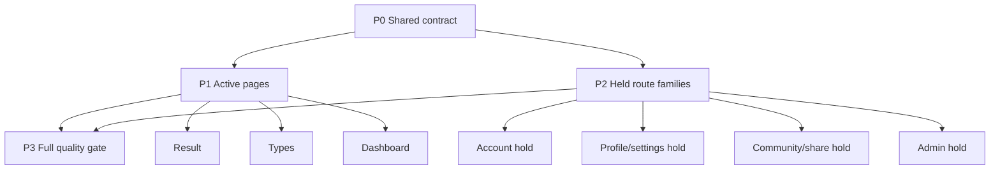

# MBTI Z UI Redesign V2 Task Pack

วันที่: 2026-07-15

เอกสารชุดนี้แปลง `docs/mbti-z-responsive-redesign-v2-plan.md` จากแผนระดับ wave ให้เป็น execution backlog ที่แบ่งงานได้หลาย task และทำคู่ขนานได้ โดยยังคงหลัก `page-ux-sprint`: screenshot ก่อน, scope ชัด, แก้เฉพาะ task ที่เลือก, ตรวจด้วย browser หลังแก้

Inventory ปัจจุบัน: `12` Markdown files, `30` routes และ task definitions/route-level QA IDs ครบทั้ง active product กับ held surfaces

## 1. Objective

- ปรับ UI/UX ครบ `30` user-facing routes ใน Pages Router
- ทำ active guest product ให้ใช้ `Signal & Story` direction เดียวกัน
- ลด card-heavy, border-heavy, glow-heavy และ duplicated metadata
- รองรับ `320x700`, `390x844`, `768x1024`, `1024x768`, `1440x1000`, `1600x1000`
- รักษา `guest-local`, scoring, local history, reconnect bundle และ PNG export
- ไม่เปิด auth/social/admin/cloud runtime ก่อน server-side contract พร้อม

## 2. Current Boundary

### Active product routes

| Route | Runtime | Task file | Status |
| --- | --- | --- | --- |
| `/` | guest product | `01-home.md` | Implemented; native zoom passed |
| `/quiz` | guest product | `02-quiz.md` | Implemented; native zoom passed |
| `/result/[id]` | guest product | `03-result.md` | Implemented; native zoom and current WebKit export passed |
| `/types` | public encyclopedia | `04-types.md` | Implemented; native zoom and 16/16 asset recognizability passed |
| `/dashboard` | local guest archive | `05-dashboard.md` | Implemented; native zoom passed |

### Held route families

| Family | Routes | Task file | Runtime rule | Status |
| --- | ---: | --- | --- | --- |
| Account entry | 3 | `06-account-hold.md` | Keep account flow unavailable | Implemented; native zoom passed |
| Profile/settings/verification | 11 | `07-profile-settings-hold.md` | Keep `RelaunchState` | Implemented; native zoom passed |
| Community/share/card | 6 | `08-community-share-hold.md` | Keep `RelaunchState` | Implemented; native zoom passed |
| Admin operations | 5 | `09-admin-hold.md` | Keep `RelaunchState` and no admin data | Implemented; native zoom passed |

Total: `5 active + 25 held = 30 routes`.

## 3. Task Status Vocabulary

- `DONE`: implementation and stated evidence exist
- `READY`: dependencies satisfied, task can start now
- `BLOCKED`: external decision/runtime/fixture required
- `PENDING`: dependency not completed
- `VERIFY`: implementation exists but current V2 evidence is incomplete
- `PARTIAL`: implementation/evidence pass except for a named residual gate
- `DEFERRED`: intentionally outside current guest-local release

## 4. Task Packet Contract

ทุก task ต้องระบุ:

1. `ID` ที่คงที่
2. `Status`, `Priority`, `Parallel group`
3. route/state ที่ได้รับผล
4. dependencies
5. files likely to change
6. implementation checklist
7. explicit non-scope
8. acceptance criteria ที่สังเกตได้
9. commands และ browser evidence

ห้ามใช้ task เช่น “ทำให้สวยขึ้น” หรือ “แก้ responsive” โดยไม่มี state, viewport และ pass condition

## 5. Parallel Execution Map

### Parallel group P0: Shared contract

- `SYS-001` route and state manifest
- `SYS-002` Signal token coverage
- `SYS-003` responsive container/control contract
- `SYS-004` fixture strategy
- `SYS-005` screenshot and metrics harness

### Parallel group P1: Active pages

เริ่มพร้อมกันได้หลัง `SYS-001..005` พร้อม:

- `RESULT-*`
- `TYPES-*`
- `DASH-*`
- `HOME-HARD-*`
- `QUIZ-HARD-*`

แต่ task ที่แก้ shared component เดียวกันต้อง serialize:

- `ResultShareCard` owner: Result ก่อน Dashboard
- `AnimalPortrait` owner: Result ก่อน Types
- reconnect actions owner: Dashboard ก่อน Account Hold

### Parallel group P2: Held routes

ทำพร้อมกันได้ตาม scenario:

- `ACCOUNT-*`
- `PROFILE-*`
- `COMMUNITY-*`
- `ADMIN-*`

แต่ห้ามเปิด backend/auth/social/admin behavior ใน UI redesign task

### Parallel group P3: Quality gate

เริ่มเมื่อ active และ held route tasks ที่เลือกใน release batch ผ่าน page-level QA

## 6. Recommended Batch Order

### Batch A: Unlock parallel work

1. `SYS-001` สร้าง route/state manifest
2. `SYS-002` ล็อก token migration rule
3. `SYS-004` เตรียม deterministic fixtures
4. `SYS-005` เตรียม screenshot/DOM audit matrix

### Batch B: Highest user value

ทำสามสายพร้อมกัน:

- Stream B1: `RESULT-001..012`
- Stream B2: `TYPES-001..010`
- Stream B3: `DASH-001..011`

### Batch C: Existing-page hardening

- `HOME-HARD-001..004`
- `QUIZ-HARD-001..006`

### Batch D: Held routes

- แก้ shared hold templates ตาม scenario
- รัน route-specific QA ครบ 25 routes

Status: `DONE WITH RESIDUALS` on 2026-07-15

- contract verifier passes all 25 routes
- production browser sweep passes 75 required samples and 58 base/stress screenshots
- Account Hold extended matrix adds 9 passing samples at 768, 1024 and 1600
- native Chrome 200% closed on 2026-07-16 across representative active and held routes

### Batch E: Full gate

- required gates: `QA-001..011`
- optional archive: `QA-012`

Status: `DONE` on 2026-07-16

- strict project verifier passes 30 routes, 88 viewport samples, 17 active states and 8 dynamic samples
- current-source project rerender passes 30 routes and 88 viewport samples; `npm run ui:v2:quality` now rejects stale browser evidence when render-affecting source files are newer than the report
- Result adds 48 four-house/two-locale samples and four current `1080x1350` API exports
- full command gate passes lint, typecheck, build, runtime, auth, reconnect, manifest, fixtures and diff checks
- native 200% zoom, current WebKit export and 16-animal recognizability proof closed on 2026-07-16
- Figma sync is intentionally deferred as an optional design archive and is not a completion gate
- evidence: `output/ui-skills-router/2026-07-15/v2-08-full-quality/audit-report.json`
- current-source evidence: `output/ui-skills-router/2026-07-16/v2-10-completion-audit/project-matrix-report.json`
- closure evidence: `output/ui-skills-router/2026-07-16/native-zoom-current/`, `output/ui-skills-router/2026-07-16/webkit-export-current/` and `output/ui-skills-router/2026-07-16/animal-recognizability-after/`

## 7. Definition Of Ready

Task พร้อม implement เมื่อ:

- target route เปิดจาก production build ได้
- source files และ child components ถูกระบุ
- fixture/state สร้างซ้ำได้โดยไม่ใช้ production data
- baseline screenshot มีอย่างน้อย `390`, `768`, `1440`
- issue มี evidence จาก screenshot, DOM, console หรือ source
- non-scope และ acceptance ชัด

## 8. Definition Of Done

Page task ปิดได้เมื่อ:

- acceptance criteria ผ่านทุกข้อ
- loading, empty, error/not-found และ populated state ที่เกี่ยวข้องถูกตรวจ
- ไม่มี horizontal overflow
- ไม่มี incoherent overlap หรือ fixed region บัง content
- interactive target หลักไม่น้อยกว่า `44x44px`
- keyboard path และ focus-visible ผ่าน
- Thai/English copy ไม่ล้นหรือ truncate ความหมาย
- `npm run typecheck`, `npm run lint` ผ่าน
- `npm run build` ผ่านเมื่อแตะ shared/page export boundary
- after screenshots อยู่ใน path ของ task
- task file ถูกอัปเดต status/evidence

## 9. Global Non-Scope

- เปลี่ยน `NEXT_PUBLIC_MBTI_ASSESSMENT_RUNTIME` เป็น `cloud`
- เปิด login/register/profile/social/admin จริง
- database migration หรือ production data
- payment/premium unlock
- dependency ใหม่โดยไม่มี gap ที่พิสูจน์แล้ว
- deploy, commit, push หรือ production operation
- normalize root move หรือ revert dirty worktree

## 10. UI Skills Router Record

- scope: `project-wide`
- commands:
  - `npx --yes ui-skills start`
  - `npx --yes ui-skills categories`
  - `npx --yes ui-skills list --category craft`
  - `npx --yes ui-skills list --category taste`
  - `npx --yes ui-skills list --category accessibility`
  - `npx --yes ui-skills get pbakaus/layout`
  - `npx --yes ui-skills get pbakaus/distill`
  - `npx --yes ui-skills get pbakaus/audit`
- selected: `pbakaus/layout`, `pbakaus/distill`, `pbakaus/audit`
- used for: layout hierarchy, simplification, technical QA contract
- local source of truth: running app, route files, `design-system/mbti-z`, browser screenshots และ verification scripts

## 11. Task Files

Team roles and parallel ownership: [`AGENT-TEAM.md`](./AGENT-TEAM.md)

1. [`00-shared-foundation.md`](./00-shared-foundation.md)
2. [`01-home.md`](./01-home.md)
3. [`02-quiz.md`](./02-quiz.md)
4. [`03-result.md`](./03-result.md)
5. [`04-types.md`](./04-types.md)
6. [`05-dashboard.md`](./05-dashboard.md)
7. [`06-account-hold.md`](./06-account-hold.md)
8. [`07-profile-settings-hold.md`](./07-profile-settings-hold.md)
9. [`08-community-share-hold.md`](./08-community-share-hold.md)
10. [`09-admin-hold.md`](./09-admin-hold.md)
11. [`10-quality-gates.md`](./10-quality-gates.md)
