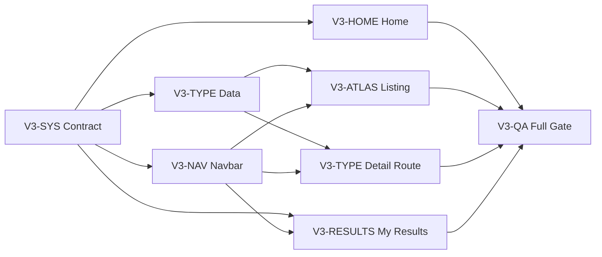

# MBTI Z UI V3 Task Pack

Plan: `docs/mbti-z-product-ui-v3-plan.md`
Status: `COMPLETE - LOCAL UAT READY`
Scope: Home, shared Navbar/locale, Type Atlas, Type Detail routes, My Results and V3 QA

## 1. Task Contract

ทุก task ต้องมี:

1. stable ID
2. one owner role
3. explicit dependencies
4. owned files และ shared files ที่ห้ามแก้เอง
5. implementation checklist
6. observable acceptance criteria
7. commands และ browser evidence
8. handoff payload

Status vocabulary:

- `READY`: เริ่มได้เมื่อ agent รับ ownership
- `PENDING`: รอ dependency
- `IN PROGRESS`: มี owner ทำอยู่
- `VERIFY`: implementation เสร็จแต่ evidence ยังไม่ครบ
- `DONE`: acceptance และ evidence ผ่าน
- `BLOCKED`: มี external/runtime decision ที่ทำต่อไม่ได้
- `DEFERRED`: ตัดออกจาก required scope โดยมีเหตุผล

## 2. Product Decisions Locked

- Home uses a deterministic Four-House constellation, not one ESTJ or random type.
- Navbar primary links are Home, Quiz and 16 Types only.
- Login is a right-side command; My Results and language live in the menu.
- Type cards navigate to `/types/[code]`; no inline disclosure.
- `/dashboard` remains the runtime route but is presented as My Results.
- Figma is not required; browser evidence is authoritative.
- Runtime stays `guest-local`.

## 3. Task Inventory

| Packet | IDs | Owner role | Initial status |
| --- | --- | --- | --- |
| Shared contract | `V3-SYS-001..007` | Lead Integrator | DONE |
| Navbar/locale | `V3-NAV-001..009` | Shell Agent | DONE |
| Home | `V3-HOME-001..011` | Home Experience Agent | DONE |
| Type Atlas | `V3-ATLAS-001..010` | Atlas Agent | DONE |
| Type Detail | `V3-TYPE-001..014` | Type Profile Agent | DONE |
| My Results | `V3-RESULTS-001..011` | My Results Agent | DONE |
| Quality gates | `V3-QA-001..014` | QA Integration Agent | DONE |

## 4. Dependency Graph

## 5. Parallel Execution

### Batch A: contract lock

- Lead completes `V3-SYS-001..007` alone.
- Output is a signed ownership table, route contract and baseline evidence index.

### Batch B: parallel build

Can run together after Batch A:

- Shell Agent: Navbar/locale
- Home Experience Agent: constellation prototype and content bands
- Type Profile Agent: content schema/data validator
- My Results Agent: page hierarchy/copy

### Batch C: discovery integration

- Atlas Agent starts after content schema and Navbar locale contract stabilize.
- Type Profile Agent implements route after data validator passes.
- Home can integrate profile data only after Type Profile Agent releases read contract.

### Batch D: QA and integration

- QA Agent owns manifest, fixtures, current browser matrix and evidence docs.
- Lead resolves shared-file handoffs; feature agents do not weaken gates.

## 6. Shared File Locks

| File | Exclusive owner | Rule |
| --- | --- | --- |
| `lib/mbti-z-copy.ts` | Lead Integrator | feature agents submit requested key/value diff; no concurrent edits |
| `data/mbti/mbti-z-data.mjs` | Type Profile Agent | all schema changes serialize here |
| `styles/globals.css` | Lead Integrator | component agents prefer local Tailwind; token changes require approval |
| `pages/_app.tsx` | Shell Agent | only for shell/locale layout contract |
| `data/ui/route-state-manifest.mjs` | QA Integration Agent | update only after route implementation lands |
| `scripts/verify-ui-v2-quality.mjs` | QA Integration Agent | rename/extend without removing freshness checks |
| `package.json` / lockfile | Lead Integrator | no new dependency without written gap |

## 7. Definition Of Ready

- production build opens locally
- source files and owner are identified
- baseline screenshot exists at 390 and 1440
- fixture/state does not require production data
- copy/data contract is known
- dependencies are `DONE`
- shared-file lock is available

## 8. Definition Of Done

- task acceptance passes
- TH/EN and loading/empty/not-found states in scope pass
- no overflow or incoherent overlap
- primary controls >= 44x44px
- keyboard and focus-visible behavior passes
- reduced-motion behavior passes where motion changed
- browser screenshots and structured metrics stored under dated V3 path
- relevant command gates pass
- owner writes handoff with files, behavior, tests and residual risk

## 9. Evidence Convention

Root:

`output/ui-skills-router/YYYY-MM-DD/v3-{packet}/`

Required files per packet:

- `README.md`: scope, before/after, decisions, residuals
- `audit-report.json`: machine-readable pass/fail
- `before/` and `after/` screenshots
- runner script only when evidence cannot be reproduced by existing project scripts

Screenshot names:

`{route}-{state}-{locale}-{viewport}.png`

## 10. Non-scope Guard

Agents must not:

- switch runtime to cloud
- activate real login/account behavior
- delete Dashboard capabilities
- copy third-party type descriptions
- add random hero selection
- add Figma as a required gate
- commit, push, deploy or stage root move

## 11. Files

- `00-shared-contract.md`
- `01-navbar-locale.md`
- `02-home-experience.md`
- `03-type-atlas.md`
- `04-type-detail-routes.md`
- `05-my-results.md`
- `06-quality-gates.md`
- `AGENT-TEAM.md`

## 12. Granular Execution Cards

งานทั้ง 76 stable task ถูกแตกเพิ่มเป็น 27 agent-ready cards ใน:

- `execution-cards/README.md`
- `execution-cards/01-baseline-audit.md` through `execution-cards/27-integration-release-checklist.md`

ใช้ workstream packets เป็น source of truth ของ requirement และใช้ execution cards เป็น unit สำหรับ assign owner, claim files, implement, verify และ handoff ห้ามสร้าง task ID ใหม่ใน card เพราะจะทำให้สถานะแยกเป็นสองแหล่ง

## 13. Completion Evidence

- Evidence root: `output/ui-redesign-v3/`
- Browser matrix: 31 route patterns, 16 concrete Type paths, 130 samples, zero failures.
- Interaction audit: 17/17 checks passed.
- My Results states: 10/10 checks passed, including a real PNG download.
- WebKit PNG regression: passed.
- Current aggregate gate: `npm run ui:v3:quality`.
