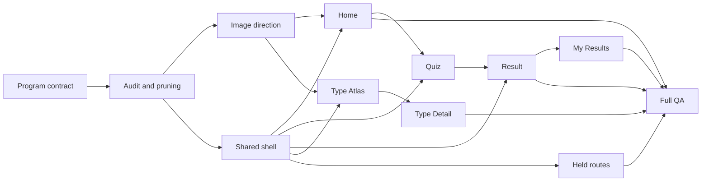

# MBTI Z UI V4 Task Pack

Plan: `docs/mbti-z-product-ui-v4-plan.md`
Status: `IMPLEMENTATION ACTIVE - HOME SLICE PASSED`
Scope: project-wide UI pruning, responsive redesign, image art direction, core routes, held-route consolidation and V4 QA

Current evidence and card status: `EXECUTION-STATUS.md`

## Fantasy Art And Motion V2 Overlay

The post-Home visual change request is tracked separately to preserve the 142-task V4 ledger:

- master plan: `../mbti-z-fantasy-art-motion-v2-plan.md`
- official-source research: `FANTASY-ART-MOTION-V2-RESEARCH.md`
- image model system prompt: `FANTASY-ART-V2-SYSTEM-PROMPT.md`
- 136 stable tasks: `FANTASY-ART-MOTION-V2-TASKS.md`
- 28 assignable cards: `fantasy-art-motion-v2-cards/`

The overlay is planning-ready but has not generated pilot images, changed runtime UI, pushed GitHub state or deployed Vercel yet.

## 1. Task Model

งานถูกแตกเป็น 142 stable tasks และ 32 execution cards แต่ละ card ต้องมี owner คนเดียว, dependencies ที่ปิดแล้ว, writable files, evidence path และ acceptance ที่ตรวจได้

Status vocabulary:

- `READY`: dependency พร้อมและรับงานได้
- `PENDING`: รอ dependency หรือ approval
- `IN PROGRESS`: agent claim งานแล้ว
- `VERIFY`: implementation เสร็จ รอ evidence/gate
- `DONE`: acceptance ผ่านจาก current source
- `BLOCKED`: external decision ทำให้เดินต่อไม่ได้
- `DEFERRED`: ตัดออกโดยมีเหตุผลและ alternative path

## 2. Stable Task Inventory

| Packet | IDs | Count | Primary owner |
| --- | --- | ---: | --- |
| Program contract | `V4-SYS-001..010` | 10 | Lead Integrator |
| Audit and pruning | `V4-AUD-001..012` | 12 | UX Audit Agent |
| Image direction | `V4-IMG-001..016` | 16 | Image Generation Agent |
| Shared shell | `V4-SHELL-001..010` | 10 | Shared Shell Agent |
| Home | `V4-HOME-001..012` | 12 | Core Journey Agent |
| Quiz | `V4-QUIZ-001..010` | 10 | Core Journey Agent |
| Result | `V4-RESULT-001..012` | 12 | Core Journey Agent |
| Type Atlas | `V4-ATLAS-001..010` | 10 | Type Discovery Agent |
| Type Detail | `V4-TYPE-001..014` | 14 | Type Discovery Agent |
| My Results | `V4-DASH-001..010` | 10 | Results And Hold Agent |
| Held routes | `V4-HOLD-001..008` | 8 | Results And Hold Agent |
| Quality gates | `V4-QA-001..018` | 18 | QA Evidence Agent |

## 3. Dependency Graph



## 4. Required Sprint Loop

แต่ละ core route ทำตาม loop นี้:

```text
baseline screenshots
-> page audit + selected ui-skills context
-> approval packet
-> approved implementation
-> after screenshots at same states/viewports
-> route gate
-> handoff to next route
```

ห้าม implementation หลาย route พร้อมกันถ้ายัง share `Navbar`, global tokens, copy source หรือ asset manifest ที่ยังไม่ lock

## 5. Shared File Locks

| File/family | Exclusive owner | Rule |
| --- | --- | --- |
| `styles/globals.css` | Lead Integrator | token/global primitive changes only |
| `pages/_app.tsx` | Shared Shell Agent | provider/shell only |
| `components/Navbar.tsx` | Shared Shell Agent | no feature-agent direct edits |
| `lib/mbti-z-copy.ts` | Lead Integrator | agents submit copy-key request |
| `data/mbti/**` | Type Discovery Agent | content/schema and validator serialized here |
| `public/mbti-z/v4/**` | Image Generation Agent | versioned production assets only |
| `data/ui/**` and V4 QA scripts | QA Evidence Agent | update after behavior lands |
| `package.json` / lockfile | Lead Integrator | no dependency without gap review |

## 6. Evidence Root

```text
output/ui-redesign-v4/YYYY-MM-DD/<card-or-route>/
  before/
  concepts/
  after/
  audit-report.json
  README.md
```

Evidence must identify current commit SHA when available, dirty-worktree fingerprint, route, state, locale, viewport and generated asset versions.

## 7. Stop Conditions

- shared file already claimed
- implementation requires cloud/auth activation
- generated image has baked text, watermark, unclear rights or unstable subject
- screenshot passes only by hiding required content
- responsive fix depends on accumulating arbitrary one-off breakpoints
- V3 functional gate regresses
- current route/state cannot be reproduced

## 8. Files

Read in this order:

1. `docs/mbti-z-product-ui-v4-plan.md`
2. `SKILL-MATRIX.md`
3. `AGENT-TEAM.md`
4. `UI-PRUNING-MATRIX.md`
5. `IMAGE-ASSET-PLAN.md`
6. `IMAGE-MODEL-SYSTEM-PROMPT.md` and `IMAGE-DECISION-MANIFEST.md` for image work
7. relevant workstream packet
8. assigned execution card
